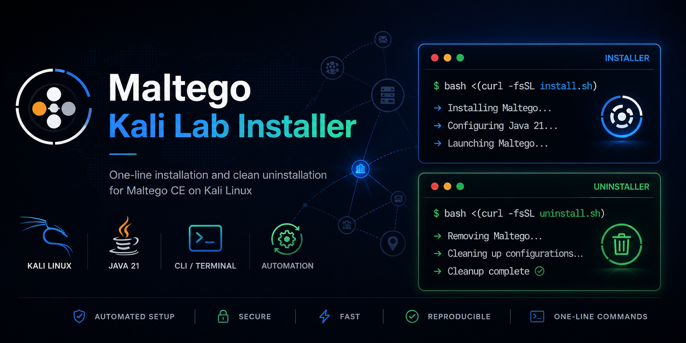
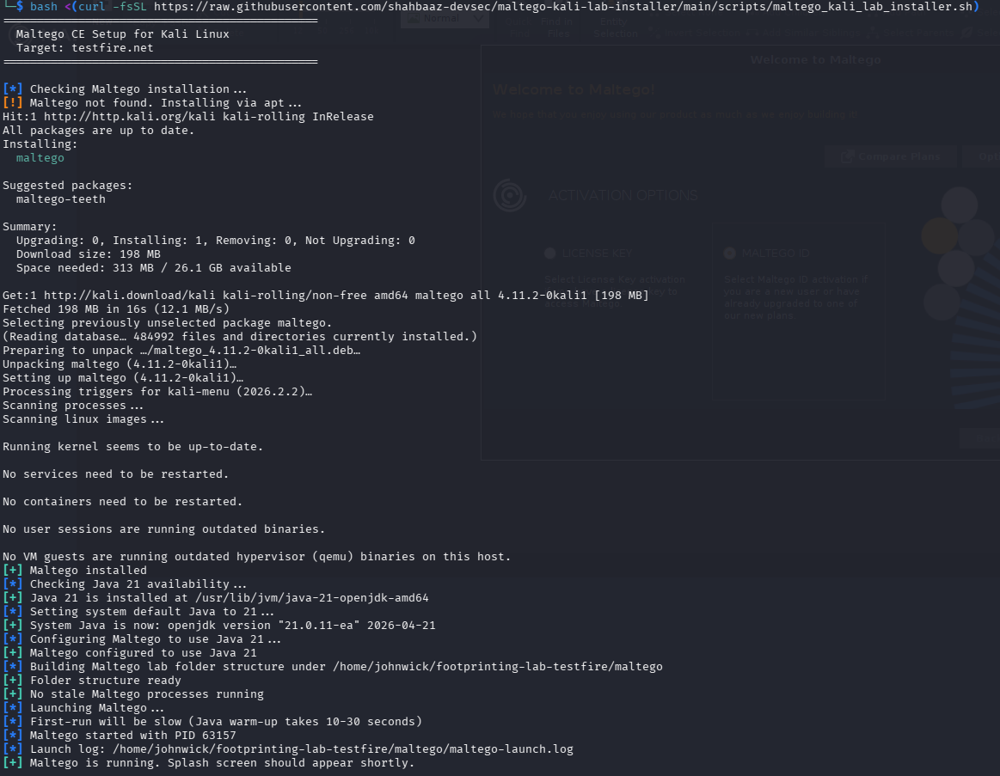
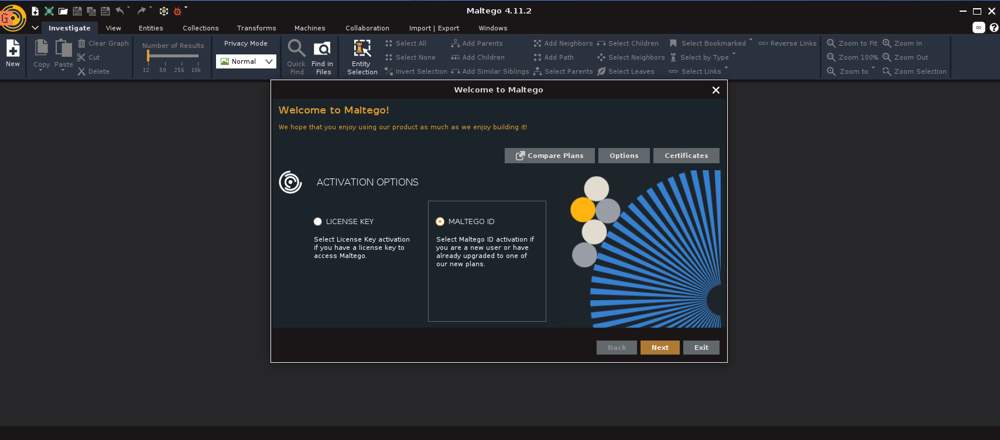
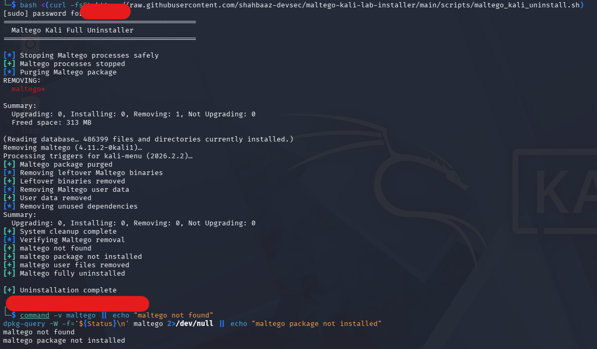

# 🧠 Maltego Kali Lab Installer





## 🚀 Automated Maltego Setup for Kali Linux

A **production-ready installer** that automates the setup of **Maltego CE on Kali Linux**, including:

- Java 21 compatibility fix (critical for modern systems)
- Automated installation via Kali repositories
- Clean workspace setup
- One-line execution
- Safe and complete uninstallation

---

## ⚡ One-Line Installation

```bash
bash <(curl -fsSL https://raw.githubusercontent.com/shahbaaz-devsec/maltego-kali-lab-installer/main/scripts/maltego_kali_lab_installer.sh)
````

---

## 🧹 One-Line Uninstallation

```bash
bash <(curl -fsSL https://raw.githubusercontent.com/shahbaaz-devsec/maltego-kali-lab-installer/main/scripts/maltego_kali_uninstall.sh)
```

---

## 🔍 Verification

```bash
command -v maltego || echo "maltego not found"
dpkg-query -W -f='${Status}\n' maltego 2>/dev/null || echo "maltego package not installed"
```

Expected output:

```text
maltego not found
maltego package not installed
```

---

## ✨ Features

* ✔ Fully automated installation
* ✔ Fixes Java module compatibility issues (common Maltego failure)
* ✔ Clean lab workspace creation
* ✔ Safe process handling
* ✔ Background execution support
* ✔ One-line install & uninstall
* ✔ Reproducible environment setup

---

## 📁 Workspace Structure

```text
~/footprinting-lab-testfire/
├── maltego/
│   ├── graphs/
│   ├── exports/
│   └── maltego-launch.log
└── screenshots/
```

---

## 🧠 How It Works

1. Installs Maltego from Kali repositories
2. Installs Java 21 if not present
3. Configures Java compatibility (fixes runtime errors)
4. Creates a structured workspace
5. Launches Maltego in background
6. Provides guided next steps

---

## ⚙️ Usage

After installation:

1. Open Maltego
2. Login using Maltego ID
3. Create a new graph
4. Add a Domain entity
5. Run transforms

---

## 🐛 Troubleshooting

### Maltego not launching

```bash
pkill -f maltego
maltego
```

---

### Java errors (important)

Your script already fixes:

* `sun.awt.SunToolkit access errors`
* `sun.security.ssl issues`
* `NullPointerException in UI`

---

### Reset environment

```bash
bash <(curl -fsSL https://raw.githubusercontent.com/shahbaaz-devsec/maltego-kali-lab-installer/main/scripts/maltego_kali_uninstall.sh)
```

---

## 📸 Screenshots

### Installation from GitHub



### Maltego UI Launch



### Clean Uninstallation



---

## ⚠️ Requirements

* Kali Linux (Rolling)
* Internet connection
* Sudo privileges

---

## 🔐 Security Notice

This tool is intended for:

* OSINT
* Security research
* Ethical hacking labs

❗ Do not use on systems without permission.

---

## 📜 License

MIT License

---

## 👨‍💻 Author

**Mohammad Shahbaaz Ahmed**
DevSecOps | Cybersecurity | Automation

---
